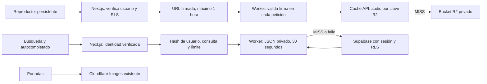

# Música continua y caché de Cloudflare

El reproductor vive junto a `ApplicationLayout`, fuera de sus wrappers dependientes de la ruta. Cambiar de disco, volver al archivo, buscar o entrar al feed conserva el mismo elemento de audio y su cola. Cerrar el reproductor o cerrar sesión conserva la limpieza existente.

## Diseño

| Dato | Clave y duración | Acceso e invalidación |
| --- | --- | --- |
| Audio | Clave R2; 1 hora en el centro de datos de Cloudflare | HMAC SHA-256 y expiración se verifican **antes** de consultar caché. Cada nueva URL se emite después de RLS. |
| Búsqueda completa y autocompletado | SHA-256 de usuario verificado (o invitado), consulta y límite; 30 s | Solo Next.js puede firmar lecturas y escrituras. Un usuario nunca reutiliza resultados de otro. No se guardan errores de DB ni resultados tras fallo de autenticación. |
| Portadas | ID y variante existentes (`avatar`, `thumbnail`, `public`) | Entrega y caché de Cloudflare Images, sin duplicar archivos. |

Se usa **Cache API** para almacenar respuestas de búsquedas calculadas por Next.js bajo RLS y para comprobar autorización en cada petición de audio. El endpoint exterior devuelve `private, no-store`; solo el almacenamiento explícito del Worker comparte bytes. No habilitar caché pública delante del Worker ni hacer público el bucket. Las firmas de búsquedas no llegan al navegador.

El audio se transmite como stream, admite GET, HEAD y rangos de bytes (incluidos sufijos y respuestas 416). En un MISS se lee R2 y se llena la caché en segundo plano con un stream independiente para evitar acumular en RAM los bytes pendientes de un oyente lento. Esa primera lectura puede suponer dos GET a R2. Solo se cachean objetos de hasta 100 MiB; los mayores siguen sirviéndose desde R2. No se modifica ningún objeto del bucket.

La caché es local al centro de datos, no promete persistencia ni tiered caching. Una búsqueda conserva como máximo 30 s en el Worker, además de la memoria de 60 s que ya usa el autocompletado. La autorización de reproducción siempre se vuelve a comprobar al emitir una firma. Una firma ya emitida mantiene su ventana máxima de 1 hora, como las firmas R2 anteriores; vaciar la cola no revoca copias de esa firma. No hay reproducción offline ni continuidad después de cerrar o recargar la pestaña.

## Configuración y activación

Cuenta prevista: `97e7fd9a393f52945ed697222f9ec3e2`; bucket existente: `yebaam-music-archive`; Worker nuevo: `yebaam-music-cache`. No requiere migración de DB, cambios DNS ni un bucket público.

1. Dar al mecanismo de despliegue acceso de edición de Workers Scripts para esta cuenta y acceso a su subdominio `workers.dev`. No cambiar permisos de lectura pública del bucket.
2. Generar un secreto aleatorio de al menos 32 bytes. Guardarlo como `MUSIC_CACHE_SECRET` en un archivo local ignorado `.dev.vars` con permisos 600 y en el gestor de secretos del hosting de Next.js. No pegarlo en terminales compartidas, historial ni documentación.
3. Validar desde la raíz: `pnpm music-cache:check`.
4. Publicar con `pnpm exec wrangler deploy -c workers/music-cache/wrangler.jsonc --secrets-file workers/music-cache/.dev.vars`.
5. Configurar `MUSIC_CACHE_ORIGIN` en Next.js con el origen HTTPS devuelto por el despliegue, sin rutas, y el mismo `MUSIC_CACHE_SECRET`. Ambas variables son **server-only**.
6. Probar un audio firmado: primer GET/Range `MISS`, siguiente `HIT`, seek correcto, petición sin firma o vencida `403`, búsqueda repetida `200` y otra identidad sin ese resultado. Publicar la app mediante el flujo habitual del proyecto.

Sin ambas variables, Next.js continúa firmando URLs R2 y consultando Supabase. Las búsquedas toleran fallos del Worker con timeout de 800 ms por operación. Para retirar el Worker del camino de audio, vaciar `MUSIC_CACHE_ORIGIN` y volver a publicar Next.js; las URLs ya cargadas seguirán vigentes hasta que se renueven o se vuelva a abrir el reproductor. No hay conmutación automática a R2 si falla un Worker ya activado.

## Verificación de esta entrega (3 de octubre de 2026)

- La prueba de navegación falló antes del arreglo al pasar de un álbum a `/musica` (el `<audio>` desaparecía). Después conserva audio, posición, cola y reproducción al navegar por archivo, búsqueda, otro álbum, feed y chat. Cerrar el reproductor sigue liberando el recurso.
- Pruebas del Worker sobre workerd/Miniflare: MISS→HIT, rangos, HEAD, 416, firma expirada/manipulada/ausente incluso con caché caliente, separación por método, límite de JSON y búsqueda inexistente.
- Chrome con sesión abierta y audio real de R2: salida del disco al archivo conservó reproducción (141.14→142.31 s); búsqueda de Tito Schipa conservó la canción Cuesta Abajo (156.76 s); se abrió otro álbum con la barra todavía activa. Chrome también mostró la pestaña musical no seleccionada con el indicador «Audio playing». La prueba automática adicional cubre `visibilitychange` a hidden/visible sin pausa ni recarga.
- TypeScript, lint de archivos modificados y build de producción aprobaron. Build ejecutado con `SENTRY_AUTH_TOKEN`, `SENTRY_ORG` y `SENTRY_PROJECT` vacíos para no subir artefactos.
- La suite global reportó 3 fallos previos: dos pruebas de ciudades esperan 8 registros pero la DB tiene 9; una prueba de login omite el parámetro `redirect` que ya devuelve el formulario. El lint global reportó 264 errores y 342 avisos ajenos a los archivos modificados.
- **La caché remota no está activada.** Se verificaron cuenta, bucket y políticas actuales de lectura mediante los MCP. La publicación fue rechazada por Cloudflare con HTTP 403, «No access to the specified resource». No se añadieron variables de caché a `.env.local` ni se publicó la app. El rendimiento y los HIT del CDN remoto quedan pendientes de acceso para desplegar.

Referencias: [Cache API y rangos](https://developers.cloudflare.com/workers/runtime-apis/cache/), [R2 Workers API](https://developers.cloudflare.com/r2/api/workers/workers-api-reference/), [Workers Cache y diferencias con Cache API](https://developers.cloudflare.com/workers/cache/limitations/).
